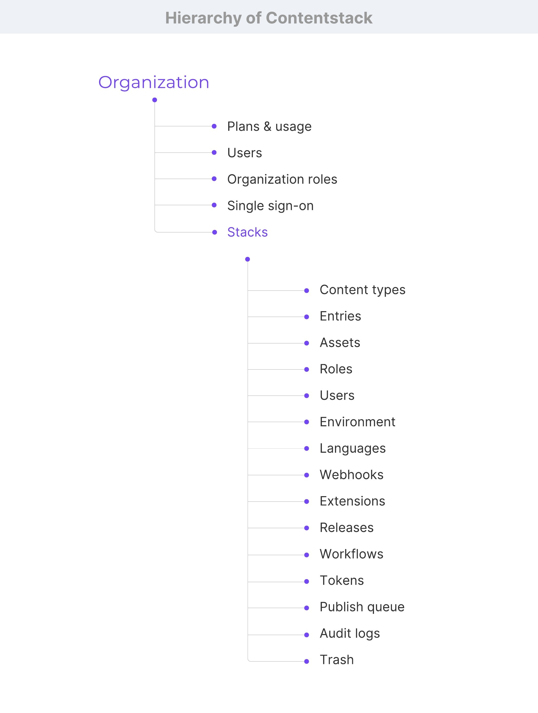
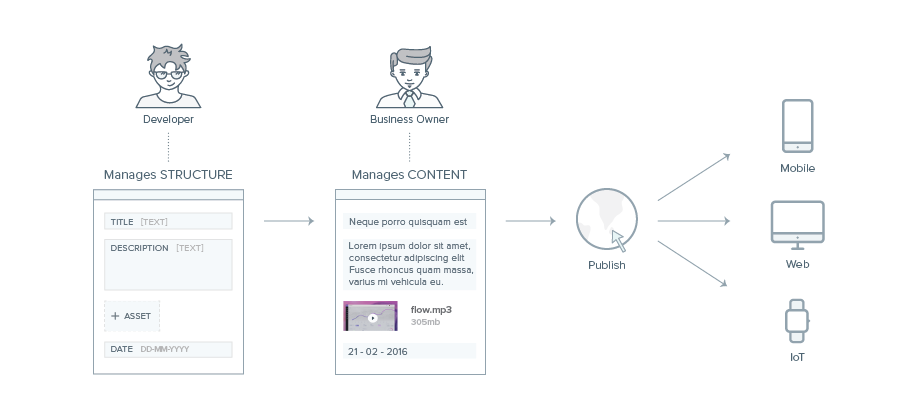

# Contentstack's Fundamentals for Front-End developers

Fundamental concepts for Front-End developers who work with Contentstack.

- [Contentstack's Fundamentals for Front-End developers](#contentstacks-fundamentals-for-front-end-developers)
  - [What is Contentstack](#what-is-contentstack)
  - [Traditional vs. Decoupled vs. Headless CMS](#traditional-vs-decoupled-vs-headless-cms)
    - [Traditional or Coupled CMS](#traditional-or-coupled-cms)
    - [Decoupled CMS](#decoupled-cms)
    - [Headless CMS](#headless-cms)
  - [Hierarchy of Data in Contentstack](#hierarchy-of-data-in-contentstack)
    - [Other key concepts of Contentstack](#other-key-concepts-of-contentstack)
  - [How Contentstack Works](#how-contentstack-works)
  - [Start Using Contentstack](#start-using-contentstack)
    - [1. Create a Stack](#1-create-a-stack)
    - [2. Create a Content Type](#2-create-a-content-type)
    - [3. Create Environment](#3-create-environment)
    - [4. Add Users to Stack and Assign Roles](#4-add-users-to-stack-and-assign-roles)
    - [5. Create Content (Entries and/or Assets)](#5-create-content-entries-andor-assets)
    - [6. Publish Content](#6-publish-content)
    - [7. Fetch Content](#7-fetch-content)
  - [Resources for the Frontend Architecture](#resources-for-the-frontend-architecture)
    - [Content Delivery APIs](#content-delivery-apis)
    - [Contentstack DataSync](#contentstack-datasync)
    - [Webhooks](#webhooks)
    - [Content Delivery SDKs](#content-delivery-sdks)
  - [Know more](#know-more)

## What is Contentstack

Contentstack is a **headless content management system**. As other well-known traditional CMSs, it provides the infrastructure to create and manage content, but it serves content in a presentation-independent way, without any single presentation layer, such as these other CMSs for which content management and presentation are tightly bounded.

We can define Contentstack as a CMS backend. It provides all the backend tools that are needed to create and publish content via APIs. But it leaves the frontend tasks for the developer, providing a clear separation between content management and presentation.

## Traditional vs. Decoupled vs. Headless CMS

### Traditional or Coupled CMS

The **Traditional CMS** architecture tightly binds together the frontend and the backend. It combines everything related to an application: the application code, the content repository, the user interface for content managers, and the design templates. Due to its tightly bound nature, it is difficult to introduce any change in one component without affecting the other.

### Decoupled CMS

In Decoupled CMS architecture, the backend and the frontend decouples into two separate systems: one for content management and other for data consumption and presentation.

Once content is created in the backend, this frontend agnostic CMS architecture retrieves content via web services and APIs and delivers them to any frontend on any device or channel. Even though the backend and the frontend function independently of one another, the frontend component has a defined frontend or a specific presentation environment.

### Headless CMS

A Headless CMS shares almost all of the benefits provided by the Decoupled CMS thus it makes the presentation layer more flexible by eliminating the frontend system.

Headless CMS gives the development team the liberty to use the best-in-breed technology to develop the frontend, and content managers create content without worrying about how it would be displayed.

**Benefits** of having a Headless CMS:

- You can write applications using any programming language and use any tools and frameworks in the development process. Thus you have complete control over how and where your content appears.
- APIs make it possible to deliver content to any channel and on any device at a faster rate.
- It provides high security and high scalability.
- It’s easy and safe to integrate third-party applications into your application. Thus it’s possible to future-proof your content.

## Hierarchy of Data in Contentstack

In Contentstack, data is structured and categorized in four components:

- **Organization**. It acts as a parent entity that encapsulates stacks (and all the resources stored within), belonging to the same company or group making project management unbelievably easy.
- **Stacks** serve as a collaboration space that holds all the content related to a particular project, and stack users can work together to create, edit, approve, and publish content. A stack is a container that holds all the content (entries) and assets related to a site.
- **Content types** lets you define the structure or blueprint of a page or a section of your digital property. It helps you lay the foundation of your content. Content type consists of fields which are the building blocks for structured content. Using content types, you can create content of the same nature and pattern.
- **Content** comprises Entries and Assets.
  - An **entry** is the actual piece of content created using one of the defined content types. To create an entry, content managers simply fill data in the fields of a content type.
  - **Assets** refer to all the media files (images, videos, PDFs, audio files, and so on) uploaded to Contentstack. These files can be used in multiple entries.

### Other key concepts of Contentstack

- **Roles**. A collection of permissions that are applicable to all the users is called a Role. Using Roles, stack Owners or Admins can set specific permissions to each user.
- **Users**. A user is any member who is able to access a particular stack in an organization.
- **Environment**. A publishing environment corresponds to one or more deployment servers or a content delivery destination where the entries need to be published.
- **Language**. Contentstack offers multilingual support, which allows you to create entries in any language of your choice. Localization is the process of making an entry available in another language.
- **Extensions**. Contentstack provides its users with pre-built, ready to use, extensions to be used in content types. These can be selected from the Extensions list.
- **Releases** are a set of entries and assets that can be deployed(published or unpublished) all at once in a specific environment.
- **Workflows**. An order of steps that define the roadmap in a process is called as a Workflow in Contentstack.
- **Tokens**. Contentstack has Access Tokens, Delivery Tokens, Management Tokens, and Authtokens. These tokens are required to authorize API calls.
- **Webhooks**. In Contentstack, a user-defined HTTP callback is called a Webhook. It is an automated system that sends real-time information to third-party apps or services.
- **Publish queue**. An entry or asset that a Content Manager sends for publishing or unpublishing, the system puts the action into a publish queue. The stack user can view the status of these tasks in the Publish queue section.
- **Audit logs**. All events and activities that take place in a particular stack are recorded and displayed in the Audit log. This helps the user keep a track of all items that are published, updated, deleted and the current status of the existing content.
- **Trash**. All deleted items in Contentstack for a particular stack are stored in the Trash for a limited period of time.

## How Contentstack Works

Managing content in Contentstack is a simple 3-step process.

1. **Model your content**. Define the structure of your content in a platform-independent way. This involves creating a content type and adding relevant fields such as “single-line textbox,” “date,” “file”. Adding fields is a simple drag-and-drop process.
2. **Create content**. Once the required content types are ready, any user can add content, which is like filling up a form. Multiple users can work together in teams to create important content in multiple languages.
3. **Publish content**. The content, once created, can be published to your website, mobile app, or any other channel. The same content can be reused for any platform.

## Start Using Contentstack

To start using Contentstack, a user needs to be part of a Contentstack Organization or sign up individually.

If you don’t have a Contentstack account, you can [Request a Free Trial](https://www.contentstack.com/try-for-free/).

When you log in, depending on whether your account (trial account or invitation to an existing organization) your Contentstack instance might be clean.

### 1. Create a Stack

As you know, everything related to your site such as content types, entries, assets, localization settings, environments, and other settings reside within Stacks.

1. Click on the **+ New Stack button** at the top-right corner.
2. This opens the Create New Stack dialog box, where you need to enter the following details:
   - Name: Enter a name for your stack.
   - Description: Enter a specific description for your stack.
   - Master Language: Select the primary language of the stack.
3. Click on Create.
   This creates your first stack.

Next, you need to **model the content type** of your webpage.

After enter in, you will see the **Dashboard** page that displays the recently modified entries and assets of your stack. You can customize your stack Dashboard page, by adding your own dashboard widgets or using the default dashboard widgets to personalize it.

### 2. Create a Content Type

Content types define the structure or blueprint of your web page designed to capture content elements such as text, images, or files.

[Content Modeling](https://www.contentstack.com/docs/developers/how-to-guides/content-modeling/) helps you determine and create just the right content type that suits your needs.

1. Click on the “Content Model” icon on the left navigation panel.
2. Click on the **+ New Content Type button**.
3. This opens the Create New Content Type form where you will need to enter the basic details of the stack.
   - Type: Webpage or Content Block based on the structure of your webpage.
   - Name of your content type.
   - Content type: Single (create one-off entries) or Multiple (create multiple entries using the same content structure).
   - Description for your content type.
4. Click on Create.
5. **Add fields** in your content type. Click on the “Insert a field” link that appears when you hover your cursor below the existing fields.
6. Click on either Save or Save and Close to start using your content type.

### 3. Create Environment

Environments correspond to one or more deployment servers or a content delivery destination where you need to publish your content.

1. Click the “Settings” icon on the left navigation panel and select Environments.
2. Click on **+ New Environment**.
3. A dialog box that appears to add the following details:
   - Name: staging, development, production,...
   - Base URL used as a prefix when the URL of an entry is generated. It is important to note that base URL would be different if using different languages. In case of mobile apps or other devices, keep it blank as they fetch content directly from Contentstack servers through APIs.
4. Click on Add.

To provide read-only access to the associated environments you can make use of **Delivery Tokens**, along with the stack API key, to retrieve published content of a specific environment via API Requests.

You are now ready to start publishing/unpublishing your content in your created environment. But, before that, you can first add collaborators to your stack.

### 4. Add Users to Stack and Assign Roles

A user, if has the required permission, can invite other users to collaborate on a stack.

1. Click the “Settings” icon on the left navigation panel and select Users & Roles.
2. Click on the Invite User button.
3. Enter the email ID(s) of the user(s) you wish to invite and share the stack with. You also need to assign a role(s) to the user(s) while sharing the stack.
4. Click on Invite.

Once the invited user accepts the invitation, he/she can collaborate with you on the specified stack.

### 5. Create Content (Entries and/or Assets)

To start adding content, you need to create an entry. Entries can only be created for existing content types.

1. Click **+ New Entry**.
2. Select the content type for which you want to add the entry and click Proceed.
3. Add the relevant data for the fields, depending on the kind of content type selected:
   - Title: title for your entry
   - URL: this field will be autopopulated. You can click on the Edit icon to change it.
   - Image: click on Browse File and select any images.
   - Description: body content of your choice.
4. Click on Save.

### 6. Publish Content

Once you create an entry, you can publish it to one of the available publishing environments.

1. After creating your entry, click **Publish**.
2. A dialog box opens with the following publishing options:
   - Environment: select the environment.
   - Language: select the language you wish to publish the entry.
   - Publish At: select Publish Now or Publish Later.
3. Click on Send.

### 7. Fetch Content

You can fetch published content using the powerful tools and resources that Contentstack brings you to build the front-end and access the content, such as the Content Delivery APIs or the Content Delivery SDKs.

## Resources for the Frontend Architecture

The Contentstack resources and the flexibility they provide are practically capable of supporting any kind of front-end or deployment architecture.

### Content Delivery APIs

**What is it**: The **Content Delivery API** is used to retrieve content from your Contentstack account fetching it for your application and getting JSON payload in response delivering it to your web or mobile properties. It serves content via a content delivery network (CDN). Contentstack also provides **GraphQL Content Delivery API** support and **Sync APIs**.

**When to use it**:

- Content Delivery APIs for any project.
- GraphQL APIs for mobile applications.
- Sync APIs for offline applications.

**Documentation**:

- [Content Delivery API](https://www.contentstack.com/docs/developers/apis/content-delivery-api/)
- [GraphQL Content Delivery API](https://www.contentstack.com/docs/developers/apis/graphql-content-delivery-api/)
- [Sync APIs](https://www.contentstack.com/docs/developers/apis/content-delivery-api/#synchronization)

### Contentstack DataSync

**What is it**: Contentstack DataSync lets you sync the published data of your site with your local database.

**When to use it**: If the website is likely to be lightweight and:

- Users need to develop complex and customized websites quickly.
- You want to have a database of your choice for storing content.
- You need to ensure uninterrupted service even when Contentstack is temporarily down or slow.

**Documentation**:

- [Develop Apps with DataSync](https://www.contentstack.com/docs/developers/develop-apps-with-datasync)

### Webhooks

**What is it**: Webhooks provide a mechanism where a server-side application can notify a client-side application or any third-party app whenever the specified event occurs on the server.

**When to use it**:

- Create a cache of published content on the web server
- Integrate with third-party apps
- Notify about any changes in the app
- Automate certain tasks

**Documentation**:

- [Set up Webhooks](https://www.contentstack.com/docs/developers/set-up-webhooks/)

### Content Delivery SDKs

**What is it**: SDKs provide all the methods that you need to query the Content Delivery APIs for creating, updating, deleting, and fetching content to build application on top of any of the following languages: JavaScript, iOS, Android, NodeJS, Java, ReactNative, PHP, Ruby, and .NET.

**When to use it**:

- To get started quickly and integrate Contentstack in your application based on any of the above-mentioned platforms.

**Documentation**:,

- [Contentstack SDKs](https://www.contentstack.com/docs/developers/#development-resources-and-sdks)
- [Contentstack JavaScript SDK](https://www.contentstack.com/docs/developers/javascript-browser/about-javascript-delivery-sdk/)

## Know more

- [Contentstack 10 Days Lesson Plan](https://www.contentstack.com/docs/developers/new-trial-10-day-lesson-plan/)
- [Developers Documentation](https://www.contentstack.com/docs/developers/)
- [How To Guides](https://www.contentstack.com/docs/developers/how-to-guides/)
- [Glossary](https://www.contentstack.com/docs/overview/glossary/)
